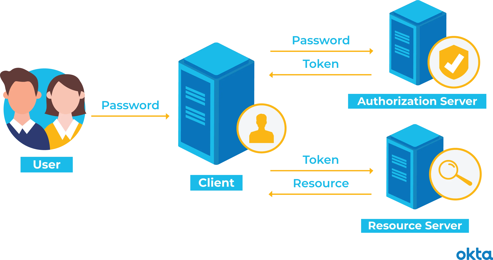

# Autenticación Basada en Tokens

La autenticación basada en tokens es un protocolo que permite a los usuarios verificar su identidad y, a cambio, recibir un único [token de acceso](https://www.okta.com/identity-101/access-token/). Durante la vigencia del token, los usuarios pueden acceder al sitio web o la aplicación para los cuales se emitió el token, en lugar de tener que volver a ingresar credenciales cada vez que regresan a la misma página web, aplicación o recurso protegido con ese mismo token.

Los tokens de autenticación funcionan como un boleto sellado. El usuario mantiene el acceso mientras el token sigue siendo válido. Una vez que el usuario cierra sesión o sale de una aplicación, el token se invalida.

La autenticación basada en tokens difiere de las técnicas tradicionales de autenticación basada en contraseñas o en servidores. Los tokens ofrecen una segunda capa de seguridad, y los administradores tienen un control detallado sobre cada acción y transacción.

Pero el uso de tokens requiere ciertos conocimientos de programación. La mayoría de los desarrolladores aprenden rápidamente estas técnicas, pero existe una curva de aprendizaje.

Profundicemos para que puedas determinar si los tokens son adecuados para ti y tu organización.

# Historia de los Tokens de Autenticación

La autenticación y la autorización son conceptos diferentes pero relacionados. Antes de tener tokens de autenticación, teníamos contraseñas y servidores. Utilizábamos métodos tradicionales para asegurarnos de que las personas adecuadas tuvieran acceso a las cosas adecuadas en el momento adecuado. No siempre era efectivo.

Considera las contraseñas. Por lo general, implican:

- **Generación por el usuario.** Alguien crea una combinación de letras, números y símbolos.
- **Memoria.** La persona debe recordar esa combinación única.
- **Repetición.** Cada vez que el usuario necesita acceder a algo, debe ingresar la contraseña.

El robo de contraseñas es común. De hecho, uno de los primeros casos documentados de robo de contraseñas ocurrió en 1962. Las personas no pueden recordar todas sus contraseñas, por lo que recurren a trucos, como:

- **Escribirlas todas.** Trozos de papel con contraseñas son un problema de seguridad.
- **Repetirlas.** Las personas tienden a usar la misma contraseña en varios lugares. Si se descubre una contraseña, muchas cuentas pueden estar en peligro.
- **Cambiarlas ligeramente.** Las personas cambian una letra o número cuando se les pide actualizar una contraseña.

Las contraseñas también requieren autenticación en el servidor. Cada vez que una persona inicia sesión, la computadora crea un registro de la transacción. La carga de memoria aumenta en consecuencia.

La autenticación basada en tokens es diferente.

Con la autenticación basada en tokens, un servicio secundario verifica una solicitud al servidor. Una vez que se completa la verificación, el servidor emite un token y responde a la solicitud.

El usuario puede que aún tenga que recordar una contraseña, pero el token ofrece otra forma de acceso que es mucho más difícil de robar o superar. Además, el registro de la sesión no ocupa espacio en el servidor.

# 3 Tipos de Tokens de Autenticación

Todos los tokens de autenticación permiten el acceso, pero cada tipo funciona de manera un poco diferente.

Estos son tres tipos comunes de tokens de autenticación:

- **Conectado:** Claves, discos, unidades y otros dispositivos físicos se conectan al sistema para acceder. Si alguna vez has usado un dispositivo USB o una tarjeta inteligente para iniciar sesión en un sistema, has utilizado un token conectado.
- **Sin contacto:** Un dispositivo está lo suficientemente cerca de un servidor como para comunicarse con él, pero no se conecta físicamente. El llamado "[anillo mágico](https://smallbiztrends.com/2017/07/token-ring-will-replace-passwords.html)" de Microsoft sería un ejemplo de este tipo de token.
- **Desconectado:** Un dispositivo puede comunicarse con el servidor a largas distancias, incluso si nunca toca otro dispositivo en absoluto. Si alguna vez has utilizado tu teléfono para un proceso de autenticación de dos factores, has utilizado este tipo de token.

En los tres escenarios, el usuario debe hacer algo para iniciar el proceso. Puede que necesite ingresar una contraseña o responder a una pregunta. Pero incluso cuando completan esos pasos preliminares de manera perfecta, no pueden obtener acceso sin la ayuda de un token de acceso.

# Autenticación por Token en 4 Sencillos Pasos

Utiliza un sistema de autenticación basado en tokens, y los visitantes verificarán sus credenciales solo una vez. A cambio, recibirán un token que les permite acceder durante el período de tiempo que determines.

El proceso funciona de la siguiente manera:

- **Solicitud:** La persona solicita acceso a un servidor o recurso protegido. Esto podría implicar un inicio de sesión con una contraseña, o podría implicar otro proceso que especifiques.
- **Verificación:** El servidor determina que la persona debe tener acceso. Esto podría implicar verificar la contraseña con el nombre de usuario, o podría implicar otro proceso que especifiques.
- **Tokens:** El servidor se comunica con el dispositivo de autenticación, como un anillo, una llave, un teléfono u otro dispositivo similar. Después de la verificación, el servidor emite un token y lo entrega al usuario.
- **Almacenamiento:** El token se encuentra en el navegador del usuario mientras continúa el trabajo.

Si el usuario intenta visitar una parte diferente del servidor, el token se comunica nuevamente con el servidor. El acceso se concede o se deniega según el token.

Los administradores establecen límites en los tokens. Puedes permitir un token de un solo uso que se destruye inmediatamente cuando la persona cierra sesión. O puedes configurar el token para que se autodestruya al final de un período de tiempo especificado.

# JSON Web Token (JWT): Una Forma Especial de Token de Autenticación

Dado que muchos usuarios acceden a sistemas a través de teléfonos móviles (aplicaciones) y aplicaciones web en la actualidad, los desarrolladores necesitan una forma segura de autenticación adecuada para esas plataformas.

Para resolver ese desafío, muchos desarrolladores recurren a los JSON Web Tokens (JWT) al trabajar con tokens para sus aplicaciones.

Un token JSON Web (JWT) es un [estándar abierto](https://tools.ietf.org/html/rfc7519). El producto final permite una comunicación segura entre dos partes. Los datos

 se verifican con una firma digital y, si se envían a través de HTTP, la encriptación mantiene los datos seguros.

Los JWT tienen tres componentes importantes.

1. **Encabezado:** Define el tipo de token y el algoritmo de firma involucrado en este espacio.
2. **Carga útil (Payload):** Define el emisor del token, la caducidad del token y más en esta sección.
3. **Firma:** Verifica que el mensaje no ha cambiado en tránsito con una firma segura.

La codificación une estas piezas. El producto final se parece a algo así:

No te dejes intimidar por el código JSON. Este tipo de notación es común cuando las entidades quieren intercambiar datos, y hay muchos tutoriales disponibles. Si estás interesado en usar tokens JSON pero nunca has utilizado este lenguaje antes, un recurso como este podría ser útil.

# Pros y Contras de los JWT

Existen muchas ventajas de los JWT.

- **Tamaño:** Los tokens en este lenguaje de código son pequeños y se pueden transmitir entre dos entidades rápidamente.
- **Facilidad:** Los tokens se pueden generar desde casi cualquier lugar, y no es necesario verificarlos en tu servidor.
- **Control:** Puedes especificar lo que alguien puede acceder, cuánto tiempo dura ese permiso y qué puede hacer la persona mientras está conectada.

También existen posibles desventajas.

- **Clave única:** Los JWT dependen de una sola clave. Si esa clave se ve comprometida, todo el sistema está en riesgo.
- **Complejidad:** Estos tokens no son simples de entender. Si un desarrollador no tiene un conocimiento sólido de algoritmos de firma criptográfica, podría poner inadvertidamente en riesgo el sistema.
- **Limitaciones:** No puedes enviar mensajes a todos los clientes ni gestionar clientes desde el lado del servidor.

# ¿Por Qué Deberías Probar Tokens de Autorización?

Has evaluado tu estrategia actual y crees que todo está funcionando bien. ¿Por qué deberían convertirse los tokens de autorización en parte de tus sistemas? Los desarrolladores obtienen beneficios muy reales al dar ese paso.

Los tokens de autorización son buenos para los administradores de sistemas que:

- **Conceden acceso temporal con frecuencia.** Tu base de usuarios fluctúa según la fecha, la hora o un evento especial. Conceder y revocar el acceso repetidamente es agotador. Los tokens podrían ser útiles.

   Por ejemplo, los administradores de sitios de bibliotecas universitarias podrían apreciar un enfoque de tokens.

- **Requieren acceso granular.** Tu servidor otorga acceso en función de propiedades específicas del documento, no de propiedades del usuario. Las contraseñas no permiten ese tipo de detalle fino.

   Por ejemplo, diriges una revista en línea. Quieres que todos lean y comenten solo un documento, no otros. Los tokens podrían permitir esto.

- **Son objetivos principales de ataques informáticos.** Tu servidor contiene documentos sensibles que podrían causar un daño intenso a tu empresa si se divulgan. Una contraseña simple no ofrece suficiente protección. Un dispositivo de hardware ayuda bastante.

Existen muchos otros casos de uso de tokens de autenticación. Pero esta lista rápida podría estimular tu creatividad, y cuanto más pienses en los beneficios, es más probable que te sumes.

# Sigue las Mejores Prácticas de los Tokens de Autenticación

Los tokens de autenticación están destinados a mejorar tus protocolos de seguridad y mantener tu servidor seguro. Sin embargo, no funcionarán eficazmente si no construyes tus procesos con la seguridad en mente.

Tus tokens de autenticación deben ser:

- **Privados:** Los usuarios no pueden compartir dispositivos de autenticación de tokens ni pasárselos entre departamentos. Al igual que no compartirían contraseñas, no deben compartir ninguna otra parte de tu sistema de seguridad.
- **Seguros:** La comunicación entre el token y tu servidor debe ser segura mediante conexiones HTTPS. La encriptación es una parte crítica para mantener los tokens seguros.
- **Probados:** Realiza pruebas periódicas de tokens para asegurarte de que tu sistema sea seguro y funcione correctamente. Si detectas un problema, soluciónalo rápidamente.
- **Apropiados:** Elije el tipo de token correcto para tu caso de uso individual. Por ejemplo, los JWT no son ideales para tokens de sesión. Pueden ser costosos y los riesgos de seguridad relacionados con la interceptación son imposibles de eliminar. Asegúrate de siempre elegir la herramienta adecuada para el trabajo.

No tomes a la ligera tu decisión sobre los tokens de autenticación. Investiga, consulta con tus colegas y asegúrate de estar haciendo el mejor trabajo posible para tu empresa.
