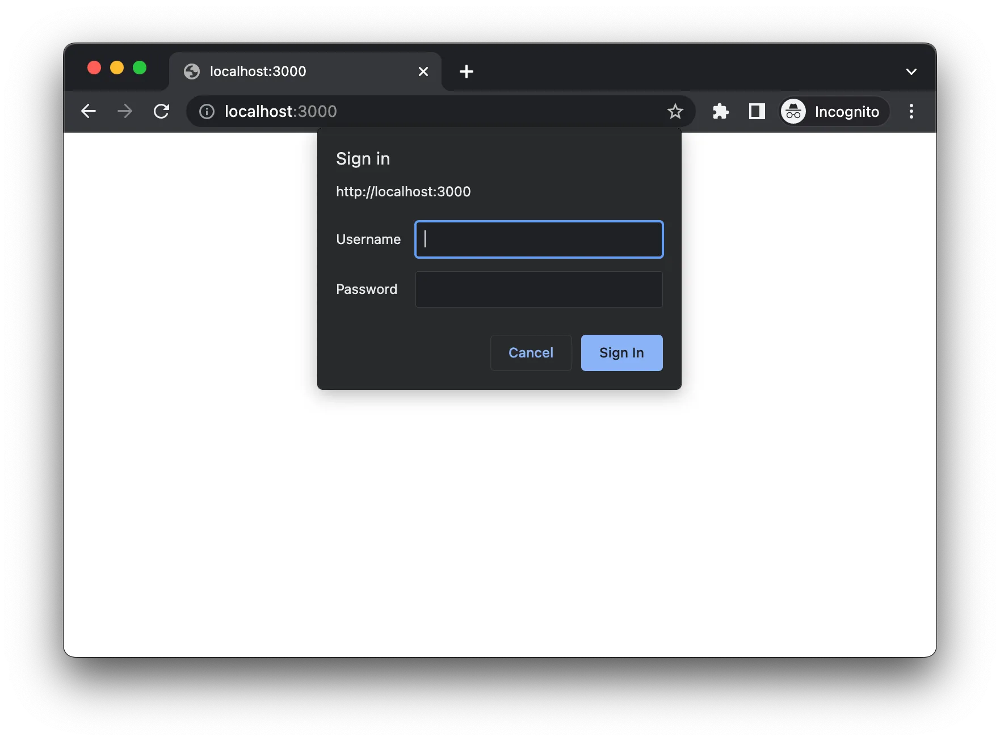

# Autenticación Básica

Dado el nombre "Autenticación Básica", no debes confundir la Autenticación Básica con la autenticación estándar de nombre de usuario y contraseña. La autenticación básica es una parte de la especificación HTTP, y los detalles se pueden encontrar en el RFC7617.

Dado que es una parte de las especificaciones de HTTP, todos los navegadores tienen soporte nativo para la "Autenticación Básica HTTP".

# **Autenticación Básica HTTP**

Aprende qué es la Autenticación Básica HTTP y cómo implementarla en Node.js.

Nuestra última guía trató sobre los **[conceptos básicos de la autenticación](https://roadmap.sh/guides/basics-of-authentication)**, donde discutimos la autenticación, la autorización, los tipos de autenticación, los factores de autenticación, las estrategias de autenticación, y más.

En esta guía de hoy, aprenderemos sobre la autenticación básica y veremos cómo podemos implementarla en Node.js. Tenemos una **[guía visual sobre la autenticación básica](https://roadmap.sh/guides/basic-authentication)** y un video ilustrativo. Mira el video a continuación o continúa leyendo:

## **¿Qué es la Autenticación Básica?**

Dado el nombre "Autenticación Básica", no debes confundirla con la autenticación estándar de nombre de usuario y contraseña. La autenticación básica es una parte de la especificación HTTP, y los detalles se pueden **[encontrar en el RFC7617](https://www.rfc-editor.org/rfc/rfc7617.html)**.

Dado que es parte de las especificaciones de HTTP, todos los navegadores tienen soporte nativo para la "Autenticación Básica HTTP". A continuación, se muestra una captura de pantalla de la implementación en Google Chrome.



## **¿Cómo Funciona?**

Ahora que sabemos qué es la autenticación básica, la pregunta es: ¿cómo funciona? La respuesta es: está controlada por la respuesta del servidor.

### **Paso 1**

Cuando el navegador solicita por primera vez al servidor, el servidor intenta verificar la disponibilidad de la cabecera de **`Authorization`** en la solicitud. Dado que es la primera solicitud, no se encuentra ninguna cabecera de **`Authorization`** en la solicitud. Entonces, el servidor responde con el código de respuesta **`401 No Autorizado`** y también envía la cabecera de **`WWW-Authenticate`** con el valor establecido en **`Basic`**, lo que le indica al navegador que debe activar el flujo de autenticación básica.

```bash
401 No Autorizado
WWW-Authenticate: Basic realm='user_pages'
```

Si observas la respuesta, tenemos un parámetro adicional llamado **`realm`**, que es simplemente un valor asignado a un grupo de páginas que comparten las mismas credenciales.

El navegador podría usar Realm para almacenar en caché la credencial. En el futuro, cuando haya un fallo de autenticación, el navegador verificará si tiene las credenciales en la caché para el ámbito dado del dominio, y podría utilizar las mismas credenciales.

## **Paso 2**

Al recibir la respuesta del servidor, el navegador notará la cabecera de **`WWW-Authenticate`** y mostrará el cuadro de diálogo de autenticación.


## **Paso 3**

Después de que el usuario envía las credenciales a través de este cuadro de diálogo de autenticación, el navegador codificará automáticamente las credenciales utilizando la codificación **`base64`** y las enviará en la cabecera de **`Authorization`** de la misma solicitud.

### **Paso 4**

Al recibir la solicitud, el servidor descodificará y verificará las credenciales. Si las credenciales son válidas, el servidor enviará la respuesta al cliente.

Así es como funciona la Autenticación Básica.

## **Autenticación Básica en Node.js**

He preparado un proyecto de ejemplo en Node.js, que se puede encontrar en GitHub en **[kamranahmedse/node-basic-auth-example](https://github.com/kamranahmedse/node-basic-auth-example)**. Si observas el código del proyecto, tenemos dos archivos: **`index.js`** con el siguiente contenido:

```javascript
// src/index.js
const express = require('express');
const authMiddleware = require('./auth');
const app = express();
const port = 3000;

// Este middleware es donde tenemos la
// implementación de autenticación básica
app.use(authMiddleware);

app.get('/', (req,res) => {
  res.send('¡Hola Mundo!');
});

app.listen(port, () => {
  console.log(`La aplicación se ejecuta en http://localhost:${port}`);
});
```

Como puedes ver, es simplemente un servidor express regular. El registro de **`authMiddleware`** es donde tenemos todo el código para la "Autenticación Básica". Aquí está el contenido del middleware:

```javascript
// src/auth.js
const base64 = require('base-64');

function decodeCredentials(authHeader) {
  // ...
}

module.exports = function (req,res,next) {
  // Tomar la cabecera y decodificar las credenciales
  const [username, password] = decodeCredentials(
    req.headers.authorization || ''
  );

  // Verificar las credenciales
  if (username === 'admin' && password === 'admin') {
    return next();
  }

  // Responder con la cabecera de autenticación en caso de fallo de autenticación.
  res.set('WWW-Authenticate', 'Basic realm="user_pages"');
  res.status(401).send('Se requiere autenticación.');
};
```

Y así es como se implementa la autenticación básica en Node.js.