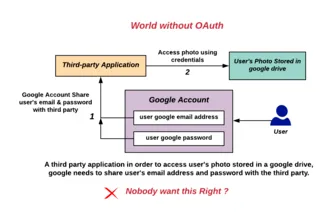
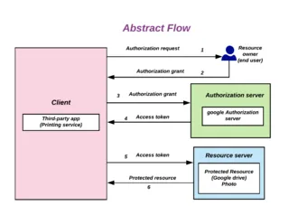
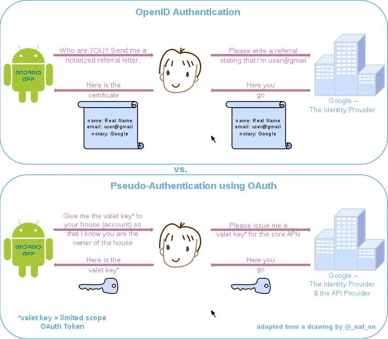

# OAuth

**OAuth** (abreviatura de "**Open Authorization**") es un estándar abierto para la delegación de acceso, comúnmente utilizado como una forma para que los usuarios de Internet otorguen a sitios web o aplicaciones acceso a su información en otros sitios web sin proporcionarles las contraseñas. Esta mecánica es utilizada por empresas como Amazon, Google, Facebook, Microsoft y Twitter para permitir a los usuarios compartir información sobre sus cuentas con aplicaciones o sitios web de terceros.

En general, el protocolo OAuth proporciona una manera para que los propietarios de recursos proporcionen un acceso delegado seguro a los recursos del servidor a una aplicación cliente. Especifica un proceso para que los propietarios de recursos autoricen el acceso de terceros a sus recursos del servidor sin proporcionar credenciales. Diseñado específicamente para funcionar con el Protocolo de Transferencia de Hipertexto (HTTP), OAuth permite esencialmente que los tokens de acceso sean emitidos a clientes de terceros por un servidor de autorización, con la aprobación del propietario del recurso. El tercero luego utiliza el token de acceso para acceder a los recursos protegidos alojados por el servidor de recursos.

## Historia

OAuth comenzó en noviembre de 2006 cuando Blaine Cook estaba desarrollando la implementación de OpenID de Twitter. Mientras tanto, Ma.gnolia necesitaba una solución para permitir a sus miembros con OpenIDs autorizar a los widgets del panel de control para acceder a su servicio. Cook, Chris Messina y Larry Halff de Magnolia se reunieron con David Recordon para discutir el uso de OpenID con las APIs de Twitter y Magnolia para la delegación de autenticación. Concluyeron que no había estándares abiertos para la delegación de acceso a las APIs.

El grupo de discusión de OAuth se creó en abril de 2007, y en julio de 2007, el equipo redactó una especificación inicial. Eran Hammer se unió y coordinó las numerosas contribuciones de OAuth para crear una especificación más formal. El 4 de diciembre de 2007, se publicó el borrador final de OAuth Core 1.0.

En la reunión 73ª del Internet Engineering Task Force (IETF) en Minneapolis en noviembre de 2008, se llevó a cabo una reunión Birds of a Feather (BoF) de OAuth para discutir la posibilidad de llevar el protocolo al IETF para un trabajo de estandarización adicional. El evento tuvo una gran asistencia y hubo un amplio apoyo para formalizar un grupo de trabajo de OAuth dentro del IETF.

El protocolo OAuth 1.0 se publicó como RFC 5849, un Request for Comments informativo, en abril de 2010. Desde el 31 de agosto de 2010, todas las aplicaciones de terceros de Twitter han estado obligadas a utilizar OAuth.

El marco OAuth 2.0 se publicó teniendo en cuenta casos de uso adicionales y requisitos de extensibilidad recopilados de la comunidad más amplia de IETF. Aunque se basa en la experiencia de implementación de OAuth 1.0, OAuth 2.0 no es compatible con OAuth 1.0. OAuth 2.0 se publicó como RFC 6749 y el Uso de Token Bearer como RFC 6750, ambos estándares de seguimiento de Request for Comments, en octubre de 2012.

El Marco de Autorización OAuth 2.1 se encuentra en etapa de borrador y consolida la funcionalidad en los RFC de OAuth 2.0, OAuth 2.0 para aplicaciones nativas, Proof Key for Code Exchange, OAuth 2.0 para aplicaciones basadas en navegadores, las mejores prácticas de seguridad de OAuth y el uso de tokens de portador.

## Problemas de seguridad

### OAuth 1.0

El 23 de abril de 2009, se anunció una falla de seguridad de fijación de sesión en el protocolo 1.0. Afecta al flujo de autorización de OAuth (también conocido como "OAuth de 3 patas") en la Sección 6 del Protocolo Core de OAuth 1.0. Se emitió la versión 1.0a del protocolo Core de OAuth para abordar este problema.

### OAuth 2.0

En enero de 2013, el Internet Engineering Task Force publicó un modelo de amenazas para OAuth 2.0. Entre las amenazas se encuentra una llamada "Redireccionador Abierto"; a principios de 2014, una variante de esto se describió bajo el nombre de "Redirección Oculta" por Wang Jing.

OAuth 2.0 ha sido analizado utilizando un análisis formal de protocolo web. Este análisis reveló que en configuraciones con varios servidores de autorización, uno de los cuales se comporta de manera maliciosa, los clientes pueden confundirse acerca del servidor de autorización a utilizar y pueden enviar secretos al servidor de autorización malicioso (Ataque AS Mix-Up). Esto llevó a la creación de una nueva práctica recomendada de Internet que busca definir un nuevo estándar de seguridad para OAuth 2.0. Suponiendo que se aplique una solución contra el Ataque AS Mix-Up, la seguridad de OAuth 2.0 ha sido demostrada bajo modelos de ataque fuertes utilizando análisis formales.

Se ha expuesto una implementación de OAuth 2.0 con numerosas fallas de seguridad.

En abril y mayo de 2017, aproximadamente un millón de usuarios de Gmail (menos del 0.1% de los usuarios hasta mayo de 2017) fueron víctimas de un ataque de phishing basado en OAuth. Los usuarios recibieron un correo electrónico que pretendía ser de un colega, empleador o amigo que deseaba compartir un documento en Google Docs. Los que hicieron clic en el enlace dentro del correo electrónico fueron dirigidos a iniciar sesión y permitir que un programa de terceros potencialmente malicioso llamado "Google Apps" accediera a su "cuenta de correo electrónico, contactos y documentos en línea". Google detuvo el ataque de phishing "aproximadamente en una hora" y aconsejó a quienes habían otorgado acceso a su correo electrónico a través de "Google Apps" que revocaran dicho acceso y cambiaran sus contraseñas.

En el borrador de OAuth 2.1, se ha recomendado el uso de la extensión PKCE para aplicaciones nativas a todos los tipos de clientes OAuth, incluidas las aplicaciones web, para evitar ataques de inyección de código OAuth 2.0 maliciosos.

## Usos

La API de Graph de Facebook solo admite OAuth 2.0. Google admite OAuth 2.0 como el mecanismo de autorización recomendado para

 todas sus APIs. Microsoft también admite OAuth 2.0 para varias APIs y su servicio de Azure Active Directory, que se utiliza para proteger muchas APIs de Microsoft y terceros.

OAuth se puede utilizar como mecanismo de autorización para acceder a feeds de RSS/Atom seguros. El acceso a feeds RSS/ATOM que requieren autenticación siempre ha sido un problema. Por ejemplo, un feed RSS de un sitio seguro de Google no podía haber sido accedido utilizando Google Reader. En cambio, se habría utilizado OAuth de tres patas para autorizar al cliente de RSS a acceder al feed del sitio de Google.

## OAuth y otros estándares

OAuth es un servicio complementario y distinto de OpenID. OAuth no está relacionado con OATH, que es una arquitectura de referencia para la autenticación y no es un estándar de autorización. Sin embargo, OAuth está directamente relacionado con OpenID Connect (OIDC), ya que OIDC es una capa de autenticación construida sobre OAuth 2.0. OAuth tampoco está relacionado con XACML, que es un estándar de política de autorización. OAuth se puede usar en conjunto con XACML, donde OAuth se utiliza para el consentimiento de propiedad y la delegación de acceso, mientras que XACML se utiliza para definir las políticas de autorización (por ejemplo, los gerentes pueden ver documentos en su región).

### OpenID frente a la pseudoautenticación mediante OAuth

OAuth es un protocolo de autorización en lugar de un protocolo de autenticación. Utilizar OAuth por sí solo como método de autenticación puede denominarse pseudoautenticación. Las siguientes diagramas resaltan las diferencias entre el uso de OpenID (diseñado específicamente como un protocolo de autenticación) y OAuth para la autorización.

El flujo de comunicación en ambos procesos es similar:

1. (No se muestra) El usuario solicita un recurso o inicio de sesión en el sitio web desde la aplicación.
2. El sitio web verifica que el usuario no está autenticado. Formula una solicitud para el proveedor de identidad, la codifica y la envía al usuario como parte de una URL de redirección.
3. El navegador del usuario hace una solicitud a la URL de redirección para el proveedor de identidad, incluyendo la solicitud de la aplicación.
4. Si es necesario, el proveedor de identidad autentica al usuario (quizás pidiéndole su nombre de usuario y contraseña).
5. Una vez que el proveedor de identidad está satisfecho de que el usuario está suficientemente autenticado, procesa la solicitud de la aplicación, formula una respuesta y la envía de vuelta al usuario junto con una URL de redirección de regreso a la aplicación.
6. El navegador del usuario solicita la URL de redirección que va de regreso a la aplicación, incluyendo la respuesta del proveedor de identidad.
7. La aplicación decodifica la respuesta del proveedor de identidad y continúa en consecuencia.
8. (Solo OAuth) La respuesta incluye un token de acceso que la aplicación puede utilizar para obtener acceso directo a los servicios del proveedor de identidad en nombre del usuario.

La diferencia crucial es que en el caso de uso de autenticación de OpenID, la respuesta del proveedor de identidad es una afirmación de identidad, mientras que en el caso de uso de autorización de OAuth, el proveedor de identidad también es un proveedor de API, y la respuesta del proveedor de identidad es un token de acceso que puede otorgar a la aplicación acceso continuo a algunas de las API del proveedor de identidad en nombre del usuario. El token de acceso actúa como una especie de "llave de valet" que la aplicación puede incluir con sus solicitudes al proveedor de identidad, lo que demuestra que tiene permiso del usuario para acceder a esas API.

Debido a que el proveedor de identidad generalmente (pero no siempre) autentica al usuario como parte del proceso de otorgar un token de acceso OAuth, es tentador ver una solicitud exitosa de un token de acceso OAuth como un método de autenticación en sí mismo. Sin embargo, debido a que OAuth no fue diseñado con este caso de uso en mente, hacer esta suposición puede llevar a importantes fallas de seguridad.

### OAuth y XACML

XACML es un marco de autorización de control de acceso basado en políticas y basado en atributos. Proporciona:

- Una arquitectura de control de acceso.
- Un lenguaje de políticas para expresar una amplia variedad de políticas de control de acceso, incluidas las políticas que pueden utilizar los consentimientos gestionados/definidos a través de OAuth.
- Un esquema de solicitud/respuesta para enviar y recibir solicitudes de autorización.

XACML y OAuth se pueden combinar para ofrecer un enfoque más completo para la autorización. OAuth no proporciona un lenguaje de políticas para definir políticas de control de acceso. XACML se puede utilizar para su lenguaje de políticas.

Mientras que OAuth se centra en el acceso delegado (yo, el usuario, otorgo acceso a Twitter a mi muro de Facebook) y la autorización centrada en la identidad, XACML adopta un enfoque basado en atributos que puede considerar atributos del usuario, la acción, el recurso y el contexto (quién, qué, dónde, cuándo, cómo). Con XACML, es posible definir políticas como:

- Los gerentes pueden ver documentos en su departamento.
- Los gerentes pueden editar documentos que poseen en modo de borrador.

XACML proporciona un control de acceso más detallado que OAuth. OAuth está limitado en cuanto a la granularidad a las funcionalidades generales (los alcances) expuestas por el servicio de destino. Como resultado, a menudo tiene sentido combinar OAuth y XACML donde OAuth proporcionará el caso de uso de acceso delegado y la gestión de consentimiento, y XACML proporcionará las políticas de autorización que funcionarán en las aplicaciones, procesos y datos.

Por último, XACML puede funcionar de manera transparente en múltiples pilas (APIs, SSO web, ESB, aplicaciones creadas internamente, bases de datos...). OAuth se enfoca exclusivamente en aplicaciones basadas en HTTP.

## Controversia

Eran Hammer renunció a su cargo de autor principal del proyecto OAuth 2.0, se retiró del grupo de trabajo de IETF y eliminó su nombre de la especificación en julio de 2012. Hammer citó un conflicto entre las culturas web y empresarial como su razón para irse, señalando que el IETF es una comunidad que se trata "todo sobre casos de uso empresarial" y "no capaz de ser simple". Notó que lo que se ofrece

ahora es un "plan para un protocolo de autorización", que es la forma empresarial, proporcionando una "nueva frontera para vender servicios de consultoría y soluciones de integración". En comparación con OAuth 2.0 con OAuth 1.0, Hammer señala que se ha vuelto "más complejo, menos interoperable, menos útil, más incompleto y, lo más importante, menos seguro". Explica cómo los cambios arquitectónicos para 2.0 desvincularon los tokens de los clientes, eliminaron todas las firmas y la criptografía a nivel de protocolo y agregaron tokens que caducan (porque los tokens no se podían revocar), complicando el procesamiento de la autorización. Se dejaron sin especificar o limitar numerosos elementos en la especificación porque "como ha sido la naturaleza de este grupo de trabajo, ningún problema es demasiado pequeño para quedarse atascado o dejar abierto para que cada implementación decida." David Recordon también eliminó posteriormente su nombre de las especificaciones por razones no especificadas. Dick Hardt asumió el rol de editor, y el marco se publicó en octubre de 2012. David Harris, autor del cliente de correo electrónico Pegasus Mail, criticó OAuth 2.0 como "un verdadero desastre", que requiere que los desarrolladores escriban módulos personalizados específicos para cada servicio (Gmail, servicios de correo de Microsoft, etc.), y se registren específicamente con ellos.
