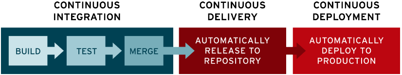

# Integración y la Distribución Continuas (CI/CD)

La CI/CD es un método para distribuir las aplicaciones a los clientes con frecuencia mediante el uso de la automatización en las etapas del desarrollo de las aplicaciones. Los principales conceptos que se le atribuyen son la integración, la distribución y la implementación continuas. Se trata de una solución para los problemas que puede generar la integración del código nuevo para los equipos de desarrollo y de operaciones (también conocida como "el infierno de la integración").

En concreto, el proceso de integración y distribución continuas incorpora la automatización y la supervisión permanentes en todo el ciclo de vida de las aplicaciones, desde las etapas de integración y prueba hasta las de distribución e implementación. Estas prácticas vinculadas se conocen como "canales de CI/CD" y cuentan con el respaldo de los equipos de desarrollo y de operaciones que trabajan en conjunto de manera ágil, con un enfoque de DevOps o de ingeniería de confiabilidad del sitio (SRE).

## Diferencias entre la Integración, la Distribución y la Implementación Continuas

Estas siglas tienen diferentes significados. "CI" siempre se refiere a la integración continua, que es un proceso de automatización para los desarrolladores. El éxito de la CI implica que se diseñen, prueben y combinen los cambios nuevos en el código de una aplicación con regularidad en un repositorio compartido. Supone una solución al problema de que se desarrollen demasiadas divisiones de una aplicación al mismo tiempo, que luego podrían entrar en conflicto entre sí.

La sigla "CD" se refiere a la distribución o la implementación continuas, y se trata de conceptos relacionados que suelen usarse indistintamente. Ambos se refieren a la automatización de las etapas posteriores del proceso, pero a veces se usan por separado para explicar hasta dónde llega la automatización.

Por lo general, la distribución continua se refiere a que los cambios que implementa un desarrollador en una aplicación se someten a pruebas automáticas de errores y se cargan en un repositorio (como GitHub o un registro de contenedores), para que luego el equipo de operaciones pueda implementarlos en un entorno de producción en vivo. Es una solución al problema de la poca supervisión y comunicación entre los equipos comerciales y de desarrollo. Con ese fin, el propósito de la distribución continua es garantizar que la implementación del código nuevo se lleve a cabo con el mínimo esfuerzo.

La implementación continua (la otra definición de "CD") hace referencia al lanzamiento automático de los cambios que implementa el desarrollador desde el repositorio hasta la producción, para ponerlos a disposición de los clientes. Así ya no se sobrecarga a los equipos de operaciones con procesos manuales que retrasan la distribución de las aplicaciones. Con este tipo de implementación, se aprovechan los beneficios de la distribución continua y se automatiza la siguiente etapa del proceso.

La CI/CD puede incluir solamente la integración y la distribución continuas, o las tres prácticas vinculadas, con la implementación continua. Para complicar un poco más las cosas, a veces se utiliza el término "distribución continua" para abarcar también los procesos de la implementación continua.

En realidad, no vale la pena profundizar en la semántica. Solo debe recordar que la integración y la distribución continuas son un proceso que suele percibirse como una canalización e implica incorporar un alto nivel de automatización permanente y supervisión constante al desarrollo de las aplicaciones.

El significado de los términos varía en cada caso y depende de la cantidad de automatización que se haya incorporado a la canalización de integración y distribución continuas. Muchas empresas comienzan con la incorporación de la CI, y luego van automatizando la distribución y la implementación, por ejemplo, con las aplicaciones desarrolladas directamente en la nube.

Nuestros especialistas pueden ayudar a que su empresa desarrolle las prácticas, las herramientas y la cultura necesarias para modernizar las aplicaciones actuales y diseñar otras nuevas con mayor eficiencia.

## Integración Continua

El objetivo del diseño de las aplicaciones modernas es que los desarrolladores puedan trabajar de forma simultánea en distintas funciones de la misma aplicación. Sin embargo, si una empresa fusiona todo el código fuente diversificado en un solo día (conocido como el "día de la fusión"), las tareas pueden tornarse tediosas, manuales y muy lentas. Esto se debe a que si un desarrollador que trabaja de forma aislada implementa un cambio en una aplicación, existe la posibilidad de que entre en conflicto con las modificaciones que otros desarrolladores implementaron al mismo tiempo. El problema puede agravarse aún más si cada desarrollador personaliza su propio entorno de desarrollo integrado (IDE) local, en lugar de que todo el equipo adopte un IDE basado en la nube.

La integración continua (CI) permite que los desarrolladores fusionen los cambios del código en un repositorio compartido con mayor frecuencia, o incluso a diario. Una vez que se incorporan las modificaciones del desarrollador, se validan con la compilación automática de la aplicación y la ejecución de distintas pruebas automatizadas (generalmente, de unidad e integración), para garantizar que los cambios no hayan introducido una falla. Esto significa que se debe probar todo, desde las clases y el funcionamiento hasta los distintos módulos que conforman toda la aplicación. Si una prueba automática detecta un conflicto entre el código nuevo y el actual, la CI facilita la resolución de esos errores con rapidez.

## Distribución Continua

Después de la automatización de las compilaciones y las pruebas de unidad e integración de la CI, la distribución continua automatiza el traslado del código validado hacia un repositorio. Por eso, para que la distribución continua sea eficaz, es importante que la CI ya esté incorporada al proceso de desarrollo. El objetivo de la distribución continua es tener una base de código que pueda implementarse en el entorno de producción en cualquier momento.

Cada etapa (desde la incorporación de los cambios al código hasta la distribución de las compilaciones listas para la producción) implica la automatización de las pruebas y del lanzamiento del código. Al final de este proceso, el equipo de operaciones puede implementar una aplicación para la producción de forma rápida y sencilla.

## Implementación Continua

La última etapa del proceso consolidado de CI/CD es la implementación continua, la cual se encarga de automatizar el lanzamiento de la aplicación a la producción, tal como lo hace la distribución continua con la compilación lista para la producción en un repositorio de código, dado que es una extensión de ella. Debido a que no hay ninguna entrada manual en la etapa anterior a la producción, la implementación continua depende en gran medida del correcto diseño de la automatización de las pruebas.

En la práctica, los cambios que implementan los desarrolladores en la aplicación en la nube podrían ponerse en marcha unos cuantos minutos después de su creación (siempre que hayan pasado las pruebas automatizadas). Esto facilita mucho más la recepción e incorporación permanente de los comentarios de los usuarios. En conjunto, todas estas prácticas de CI/CD permiten que se implementen las aplicaciones con menos riesgos, ya que es más fácil incorporar los cambios en las aplicaciones de a poco, en lugar de hacerlo todo de una sola vez. Sin embargo, también deben realizarse muchas inversiones iniciales, ya que se deben diseñar las pruebas automatizadas para que se adapten a las distintas etapas de prueba y lanzamiento en el canal de la CI/CD.

## Herramientas Comunes de CI/CD

Las herramientas de CI/CD son útiles para que los equipos automaticen el desarrollo, la implementación y las pruebas. Hay algunas que gestionan específicamente la integración (CI), otras que abordan el desarrollo y la implementación (CD), y algunas que se especializan en las pruebas permanentes u otras funciones relacionadas.

Una de las herramientas opensource más conocidas para la CI/CD es el servidor de automatización Jenkins, cuyo diseño permite gestionar cualquier sistema, desde un servidor sencillo de CI hasta un centro completo de CD.

Tekton Pipelines es un marco para las plataformas Kubernetes que ofrece una experiencia estándar de CI/CD en la nube con contenedores.

Además de Jenkins y Tekton Pipelines, estas son otras herramientas open source de CI/CD que le podrían interesar:

- **Spinnaker**: plataforma de CD diseñada para los entornos multicloud
- **GoCD**: servidor de CI/CD que se enfoca en la creación de modelos y la visualización
- **Concourse**: sistema open source de automatización constante
- **Screwdriver**: plataforma de diseño creada para la distribución continua

Es posible que a los equipos también les convenga adquirir las herramientas gestionadas de CI/CD, que ofrecen muchos proveedores. Los principales proveedores de nube pública ofrecen soluciones de CI/CD, junto con GitLab, CircleCI, Travis CI, Atlassian Bamboo y muchos más.

Además, es probable que cualquier herramienta que sea fundamental para DevOps forme parte de un proceso de CI/CD. Las herramientas para la automatización de la configuración (como Ansible, Chef y Puppet), los tiempos de ejecución de los contenedores (como Docker, rkt y cri-o) y la organización en contenedores (Kubernetes) no son herramientas específicas de CI/CD, pero aparecen en muchos de sus flujos de trabajo.
