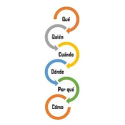

# Cinco W (5W)

Las **Cinco W** (5W) es una técnica con la que se consigue transmitir un mensaje eficazmente. Es la manera más sencilla y completa de presentar información. El origen de las 5W se remonta a hace por lo menos 28 siglos, aunque hoy en día se han añadido más preguntas a este grupo básico.

- **Qué**: son los acontecimientos, acciones o ideas que constituyen una noticia. Por ejemplo: Un accidente de moto en el que murieron dos personas. A veces, se incluye la pregunta Cuánto (How much o How many), pero esta forma parte del Qué. Por ejemplo: Provocó daño a propiedad privada con un valor de $500.

- **Quién/Quiénes**: son los protagonistas, los personajes que aparecen en la noticia. Por ejemplo: Los occisos fueron dos jóvenes de 16 y 17 años.

- **Cuándo**: sitúa la acción en un tiempo concreto. Se debe indicar su inicio, duración y fin. Por ejemplo: El incidente ocurrió el sábado a las 3 de la madrugada.

- **Dónde**: el espacio o lugar dónde han ocurrido los hechos. Por ejemplo: En el kilómetro 18 de la A-6 a la altura de Las Rozas.

- **Por Qué**: son las razones por las que ha ocurrido un acontecimiento. En ocasiones es necesario incluir los antecedentes. Por ejemplo: Según las fuentes locales, el conductor había ingerido alcohol. Dentro de esta pregunta también se puede contestar Para qué, el fin último de una acción. Por ejemplo: Previo al accidente, el conductor hizo una parada para intentar recuperar los sentidos.

- **Cómo**: circunstancias en las que se desarrollan los hechos. El motociclista derrapó, estrellándose contra una gasolinería y arrollando a uno de los trabajadores del establecimiento.

Estas preguntas son la esencia de una noticia.

## Definición

Las 5W son un estilo o guía del periodismo para saber cómo organizar una información, recoger los elementos más importantes de una noticia y entender su contexto.

- Qué: lo que se habla, su relevancia y su interés.
- Quiénes: los protagonistas de los hechos relatados.
- Cuándo: conocer y situarnos en el tiempo en el que se dio la noticia.
- Dónde: el lugar.
- Por qué: la explicación.

Además de las 5W: qué, quién, cuándo, dónde y por qué, se puede añadir una sexta: cómo. E incluso una séptima: *For What* - para qué.

Las 5W son la esencia de una noticia. Garantiza el conocimiento completo y preciso para escribir o cubrir un acontecimiento relevante y la presentación detallada de una noticia o informe.

## Ejemplo

Partiendo de la siguiente noticia del medio español El País se verá cómo quedan resueltas las 5 incógnitas:

**Premisa**: "Condenado en México uno de los asesinos de la periodista Miroslava Breach. Juan Carlos Moreno Ochoa, El Larry, preparó y ordenó el asesinato de la reportera en 2017. Breach había denunciado la cercanía de políticos y delincuentes en la sierra de Chihuahua, al norte del país".

- Qué: condenado por matar a una periodista.
- Quién/Quienes: Juan Carlos Moreno Ochoa.
- Cuándo: 2017.
- Dónde: México.
- Por qué: preparar y ordenar el asesinato.

También, en el cuerpo de la noticia, está el cómo: "contrató a dos sicarios".

## Otros Usos

Las 5W permiten presentar las informaciones de manera sencilla y completa. Esta fórmula no solo se utiliza en el periodismo, también está presente en la investigación científica y policial. Gracias a ellas el receptor entiende claramente el mensaje. Las 5W permiten obtener la historia de algo, cada pregunta debe responderse con datos concretos.
