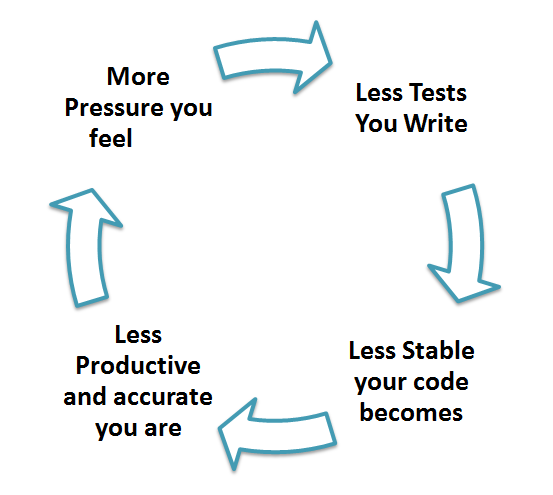

# Pruebas Unitarias

## ¿Qué es una Prueba Unitaria?

La **Prueba Unitaria** es un tipo de prueba de software en la que se prueban unidades o componentes individuales de un software. El propósito es validar que cada unidad del código de software funcione como se espera. Las Pruebas Unitarias se realizan durante la fase de desarrollo (fase de codificación) de una aplicación por parte de los desarrolladores. Las Pruebas Unitarias aíslan una sección de código y verifican su corrección. Una unidad puede ser una función, método, procedimiento, módulo u objeto individuales.

En el SDLC, STLC, el Modelo V, las Pruebas Unitarias son el primer nivel de pruebas que se realizan antes de las pruebas de integración. Las Pruebas Unitarias son una técnica de prueba WhiteBox que generalmente es realizada por el desarrollador. Sin embargo, en el mundo práctico, debido a la falta de tiempo o a la renuencia de los desarrolladores para realizar pruebas, los ingenieros de QA también realizan pruebas unitarias.

## ¿Por qué Realizar Pruebas Unitarias?

Las **Pruebas Unitarias** son importantes porque a veces los desarrolladores de software intentan ahorrar tiempo haciendo pruebas unitarias mínimas, y esto es un mito, ya que unas pruebas unitarias inadecuadas pueden llevar a un alto costo en la corrección de defectos durante las Pruebas del Sistema, las Pruebas de Integración e incluso las Pruebas Beta después de que se construye la aplicación. Si se realizan pruebas unitarias adecuadas en las primeras etapas del desarrollo, se ahorra tiempo y dinero al final.

Aquí están las razones clave para realizar pruebas unitarias en la ingeniería de software:

Niveles de Pruebas Unitarias

1. Las pruebas unitarias ayudan a corregir errores temprano en el ciclo de desarrollo y ahorran costos.
2. Ayudan a los desarrolladores a comprender la base de código de prueba y les permiten realizar cambios rápidamente.
3. Las buenas pruebas unitarias sirven como documentación del proyecto.
4. Las pruebas unitarias ayudan en la reutilización de código. Migra tanto tu código como tus pruebas a tu nuevo proyecto. Ajusta el código hasta que las pruebas se ejecuten nuevamente.

## ¿Cómo Realizar Pruebas Unitarias?

Para realizar las Pruebas Unitarias, los desarrolladores escriben una sección de código para probar una función específica en la aplicación de software. Los desarrolladores también pueden aislar esta función para probarla de manera más rigurosa, lo que revela dependencias innecesarias entre la función probada y otras unidades para que se puedan eliminar las dependencias. Los desarrolladores generalmente utilizan un [marco de Pruebas Unitarias](https://www.guru99.com/test-automation-framework.html) para desarrollar casos de prueba automatizados para las pruebas unitarias.

Las Pruebas Unitarias tienen dos tipos:

- Manuales
- Automatizadas

Las pruebas unitarias suelen ser automatizadas, pero aún se pueden realizar manualmente. La ingeniería de software no favorece uno sobre el otro, pero se prefiere la automatización. Un enfoque manual para las pruebas unitarias puede utilizar un documento de instrucciones paso a paso.

Bajo el enfoque automatizado:

- Un desarrollador escribe una sección de código en la aplicación solo para probar la función. Luego comentan y finalmente eliminan el código de prueba cuando se implementa la aplicación.
- Un desarrollador también puede aislar la función para probarla de manera más rigurosa. Esta es una práctica de pruebas unitarias más completa que implica copiar y pegar el código en su propio entorno de pruebas en lugar de su entorno natural. El aislamiento del código ayuda a revelar dependencias innecesarias entre el código probado y otras unidades o espacios de datos en el producto. Estas dependencias luego se pueden eliminar.
- Un programador generalmente utiliza un marco de Pruebas Unitarias para desarrollar casos de prueba automatizados. Utilizando un marco de automatización, el desarrollador codifica criterios en la prueba para verificar la corrección del código. Durante la ejecución de las pruebas, el marco registra los casos de prueba que fallaron. Muchos marcos también marcarán y reportarán automáticamente, en resumen, estos [casos de prueba fallidos](https://www.guru99.com/run-failed-test-cases-in-testng.html). Dependiendo de la gravedad de un fallo, el marco puede detener las pruebas posteriores.
- El flujo de trabajo de las Pruebas Unitarias es 1) Crear Casos de Prueba 2) Revisar/Revisar 3) Baseline 4) Ejecutar Casos de Prueba.

## Técnicas

Las **Técnicas de Prueba Unitaria** se categorizan principalmente en tres partes: la Prueba de Caja Negra, que implica la prueba de la interfaz de usuario junto con la entrada y la salida; la Prueba de Caja Blanca, que implica la prueba del comportamiento funcional de la aplicación de software; y la Prueba de Caja Gris, que se utiliza para ejecutar conjuntos de pruebas, métodos de prueba, casos de prueba y realizar análisis de riesgos.

Las técnicas de cobertura de código utilizadas en las Pruebas Unitarias se enumeran a continuación:

- Cobertura de Instrucciones (Statement Coverage)
- Cobertura de Decisiones (Decision Coverage)
- Cobertura de Ramas (Branch Coverage)
- Cobertura de Condiciones (Condition Coverage)
- Cobertura de Máquina de Estado Finito (Finite State Machine Coverage)

## Ejemplo de Prueba Unitaria: Objetos Falsos (Mock Objects)

Las pruebas unitarias dependen de la creación de objetos falsos (mock objects) para probar secciones de código que aún no forman parte de una aplicación completa. Los objetos falsos llenan los espacios faltantes en el programa.

Por ejemplo, es posible que tengas una función que necesite variables u objetos que aún no se han creado. En las pruebas unitarias, estos se tendrán en cuenta en forma de objetos falsos creados únicamente con el propósito de las pruebas unitarias realizadas en esa sección de código.

## Herramientas

Existen varias herramientas de prueba unitaria automatizadas disponibles para ayudar con las pruebas unitarias. A continuación, proporcionaremos algunos ejemplos:

1. [JUnit](https://www.guru99.com/junit-tutorial.html): JUnit es una herramienta de prueba de uso gratuito utilizada para el lenguaje de programación Java. Proporciona afirmaciones para identificar métodos de prueba. Esta herramienta prueba los datos primero y luego los inserta en el fragmento de código.
2. [NUnit](https://nunit.org/): NUnit es un marco de prueba de unidad ampliamente utilizado que se utiliza para todos los lenguajes de .NET. Es una herramienta de código abierto que permite escribir scripts manualmente. Admite pruebas basadas en datos que pueden ejecutarse en paralelo.
3. [JMockit](http://jmockit.github.io/index.html): JMockit es una herramienta de prueba de unidad de código abierto. Es una herramienta de cobertura de código con métricas de líneas y rutas. Permite la simulación de API con sintaxis de grabación y verificación. Esta herramienta ofrece cobertura de líneas, cobertura de rutas y cobertura de datos.
4. [EMMA](http://emma.sourceforge.net/): EMMA es un conjunto de herramientas de código abierto para analizar y generar informes sobre código escrito en el lenguaje Java. EMMA admite tipos de cobertura como método, línea y bloque básico. Está basado en Java, por lo que no tiene dependencias de bibliotecas externas y puede acceder al código fuente.
5. [PHPUnit](https://phpunit.de/): PHPUnit es una herramienta de prueba de unidad para programadores de PHP. Toma pequeñas porciones de código llamadas unidades y las prueba por separado. La herramienta también permite a los desarrolladores utilizar métodos de afirmación predefinidos para afirmar que un sistema se comporta de una cierta manera.

Estas son solo algunas de las herramientas de prueba unitaria disponibles. Hay muchas más, especialmente para lenguajes como C y Java, pero seguramente encontrarás una herramienta de prueba unitaria que se adapte a tus necesidades de programación, independientemente del lenguaje que utilices.

## Desarrollo Guiado por Pruebas (TDD)

La prueba unitaria en TDD involucra un uso extensivo de marcos de prueba. Se utiliza un marco de prueba unitaria para crear pruebas unitarias automatizadas. Los marcos de prueba unitaria no son exclusivos de TDD, pero son esenciales para él. A continuación, analizamos lo que TDD aporta al mundo de las pruebas unitarias:

- Las pruebas se escriben antes del código.
- Se depende en gran medida de los marcos de prueba.
- Se prueban todas las clases en la aplicación.
- Se facilita la integración rápida y sencilla.

## Mitos

**Mito:** Requiere tiempo, y siempre estoy sobrecargado de trabajo.

¡Mi código es sólido como una roca! No necesito pruebas unitarias.

Los mitos, por su propia naturaleza, son suposiciones falsas. Estas suposiciones conducen a un ciclo vicioso como se muestra a continuación:

La verdad es que las pruebas unitarias aumentan la velocidad de desarrollo.

Los programadores creen que las Pruebas de Integración detectarán todos los errores y no realizan pruebas unitarias. Una vez que las unidades se integran, los errores muy simples que podrían haberse encontrado y corregido fácilmente en las pruebas unitarias llevan mucho tiempo rastrearlos y solucionarlos.

## Ventajas

- Los desarrolladores que deseen aprender qué funcionalidad ofrece una unidad y cómo usarla pueden consultar las pruebas unitarias para obtener una comprensión básica de la API de la unidad.
- Las pruebas unitarias permiten al programador refactorizar el código en una fecha posterior y asegurarse de que el módulo siga funcionando correctamente (es decir, **Pruebas de Regresión**). El procedimiento es escribir casos de prueba para todas las funciones y métodos para que, cada vez que un cambio provoque un error, se pueda identificar y corregir rápidamente.
- Debido a la naturaleza modular de las pruebas unitarias, podemos probar partes del proyecto sin esperar a que se completen otras.

## Desventajas

- No se puede esperar que las pruebas unitarias atrapen todos los errores en un programa. No es posible evaluar todos los caminos de ejecución, incluso en los programas más triviales.
- Las pruebas unitarias, por su propia naturaleza, se centran en una unidad de código. Por lo tanto, no pueden detectar errores de integración o errores a nivel del sistema.

Se recomienda utilizar las pruebas unitarias en conjunto con otras actividades de prueba.

## Mejores Prácticas

- Los casos de prueba unitaria deben ser independientes. En caso de mejoras o cambios en los requisitos, los casos de prueba unitaria no deben verse afectados.
- Prueba solo un código a la vez.
- Sigue convenciones de nomenclatura claras y consistentes para tus pruebas unitarias.
- En caso de cambios en el código en un módulo, asegúrate de que haya un **Caso de Prueba** unitaria correspondiente para el módulo y que el módulo supere las pruebas antes de cambiar la implementación.
- Los errores identificados durante las pruebas unitarias deben corregirse antes de pasar a la siguiente fase en el SDLC.
- Adopta un enfoque de "prueba a medida que escribes código". Cuanto más código escribas sin realizar pruebas, más caminos tendrás que verificar en busca de errores.

## Resumen

- Las PRUEBAS UNITARIAS se definen como un tipo de prueba de software en la que se prueban unidades o componentes individuales de un software.
- Como puedes ver, las pruebas unitarias pueden ser bastante complejas o bastante simples según la aplicación que se esté probando y las estrategias, herramientas y filosofías de prueba utilizadas. Las pruebas unitarias siempre son necesarias en algún nivel. Eso es una certeza.
