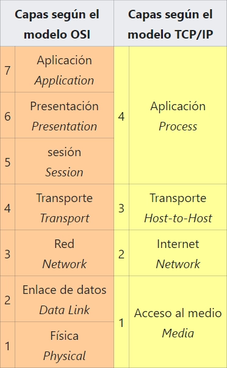

# Modelo TCP/IP

## Definición

El modelo TCP/IP es un conjunto de protocolos de red desarrollado en los años 70 por Vinton Cerf y Robert E. Kahn. Fue implementado en ARPANET, la precursora de Internet, por encargo del Departamento de Defensa de los Estados Unidos (DARPA). Este modelo se utiliza para facilitar la comunicación en redes, describiendo cómo los datos se formatean, direccionan y transmiten de un extremo a otro. Está respaldado por la Internet Engineering Task Force y se organiza en capas, lo que simplifica la implementación de software de comunicaciones al agrupar funciones relacionadas. Cada capa se basa en la anterior y se encarga de proporcionar servicios a las capas superiores y hacer que estos servicios sean transparentes para ellas.

TCP/IP es un conjunto de protocolos que permiten la comunicación entre los ordenadores pertenecientes a una red. La sigla TCP/IP significa Protocolo de control de transmisión/Protocolo de Internet. Proviene de los nombres de dos protocolos importantes incluidos en el conjunto TCP/IP, es decir, del protocolo TCP y del protocolo IP.

## Capas

### Capa 1: Acceso al Medio

En la capa de enlace los protocolos solo actúan como máximo hasta la red local a la que está conectado un host cualquiera. Esto se denomina enlace si usamos el lenguaje propio de TCP/IP. Además esta capa se sitúa en la parte más baja de dicho modelo. Como dijimos esta capa tiene en cuenta todos los hosts accesibles en la red local o dicho de otra manera, todos los hosts que se pueden alcanzar sin tener que pasar por un enrutador. Este modelo está diseñado para que el tipo de hardware usado no importe haciendo que pueda implementarse sobre cualquier tecnología de la capa de enlace. De hecho incluye también capas de los posibles enlaces virtuales que puedan haber ya sea por redes privadas virtuales y túneles de redes.

El uso que tiene la capa de enlace es permitir el paso de paquetes entre las interfaces de la capa de Internet de dos hosts diferentes en el mismo enlace. Los procesos de transmisión y recepción de paquetes en el enlace se pueden controlar en el controlador de dispositivo para la tarjeta de red, incluso en el firmware o haciendo uso de conjuntos de chips especializados.

El modelo TCP/IP incluye especificaciones para traducir los métodos de direccionamiento de red utilizados en el Protocolo de Internet a direcciones de capa de enlace, como direcciones de control de acceso al medio (o direcciones MAC).

### Capa 2: Internet

El proceso de enviar datos desde la red de origen a la red de destino mediante la interconexión de redes es lo que se conoce como enrutamiento y esto es compatible con el direccionamiento e identificación del host mediante el sistema de direccionamiento IP jerárquico. La capa de internet permite una instalación de transmisión de datagramas (así es como se llama a la PDU en la capa de Internet) no confiable entre hosts ubicados en redes IP considerablemente diferentes al reenviar datagramas a un enrutador distinto (produciéndose lo que se conoce como salto) apropiado para su posterior retransmisión a su destino. La capa de Internet es responsable de enviar paquetes de datos a través de múltiples redes. De esta manera, la capa de Internet hace posible la interconexión, el funcionamiento interno de diferentes redes IP y es como Internet se establece.

La capa de Internet no distingue entre los distintos protocolos de la capa de transporte. IP transporta datos para que los protocolos de capas superiores se encarguen de tratarlos de la manera correcta, pues no entiende de otras capas.

El Protocolo de Internet es el componente principal de la capa de Internet y define dos sistemas de direccionamiento para identificar los hosts de la red y ubicarlos en la red. El sistema de direcciones original de ARPANET y su sucesor, Internet, es el Protocolo de Internet versión 4 (IPv4) la cual utiliza una dirección IP de 32 bits y, por lo tanto, es capaz de identificar aproximadamente cuatro mil millones de hosts. Esta limitación fue eliminada en 1998 por la estandarización del Protocolo de Internet versión 6 (IPv6) que usa direcciones de 128 bits. Las implementaciones de producción de IPv6 surgieron aproximadamente en 2006.

### Capa 3: Transporte

En la capa de transporte se establecen canales de datos básicos utilizadas para hacer posible el intercambio de datos. Además establece la conectividad de host a host en forma de servicios de transferencia de mensajes de extremo a extremo independientes de las redes subyacentes e independientes de la estructura de los datos del usuario y la logística del intercambio de información.

La capa de transporte tiene 2 tipos de conexiones y son orientada a la conexión como es el TCP, o no orientado a la conexión como es el UDP. Los protocolos de esta capa pueden proporcionar control de errores, segmentación, control de flujo, control de congestión y direccionamiento de aplicaciones.

Con el objetivo de proporcionar canales de transmisión específicos, la capa de transporte establece el concepto de puerto de red. Esto es una construcción lógica numerada y que es asignada de forma específica para cada uno de los canales de comunicación que necesita una determinada aplicación. Para muchos tipos de servicios, estos números de puerto se han estandarizado para que las computadoras cliente puedan abordar servicios específicos de una computadora servidor sin la participación de servicios de directorio o descubrimiento de servicios.

TCP es un protocolo orientado a la conexión que aborda numerosos problemas de confiabilidad al proporcionar un flujo de bytes confiable:

Los datos llegan ordenados.
Los datos tienen la cantidad mínima de errores.
No llegan duplicados.
Se asegura que los paquetes llegan a su destino.
Incluye control de congestión de tráfico.
El Protocolo de datagramas de usuario (UDP) es un protocolo de datagramas no orientado a conexión. Al igual que IP, es un protocolo poco confiable. La confiabilidad se aborda mediante la detección de errores mediante un algoritmo de checksum. UDP se usa generalmente para aplicaciones como transmisión de medios (audio, video, voz sobre IP, etc.) donde la llegada a tiempo es más importante que la confiabilidad, o para aplicaciones simples de consulta / respuesta como búsquedas de DNS. El Protocolo de transporte en tiempo real (RTP) es un protocolo de datagramas que se utiliza sobre UDP y está diseñado para datos en tiempo real, como medios de transmisión.

### Capa 4: Aplicación

La capa de aplicación incluye los protocolos utilizados por la mayoría de las aplicaciones para proporcionar servicios de usuario o intercambiar datos de aplicaciones a través de las conexiones de red establecidas por los protocolos de las capas inferiores. Esto puede incluir algunos servicios básicos de soporte de red, como protocolos de enrutamiento y configuración de host. Algunos ejemplos de lo que acabamos de comentar son el protocolo HTTP o Protocolo de Transferencia de Hipertexto, el protocolo FTP o Protocolo de Transferencia de Archivos, el protocolo SMTP o protocolo de Transferencia de Correo y el Protocolo DHCP o Protocolo de Configuración Dinámica de Host. Los datos codificados de acuerdo con los protocolos de la capa de aplicación se encapsulan en unidades de protocolo de la capa de transporte (como flujos TCP o datagramas UDP), que a su vez utilizan protocolos de capas inferiores para efectuar la transferencia de datos real.

La capa de aplicación en el modelo TCP/IP corresponde a una combinación de la quinta (sesión), sexta (presentación) y séptima capa (aplicación) del modelo OSI.

En la capa de aplicación, el modelo TCP/IP distingue entre protocolos de usuario y protocolos de soporte. Los protocolos de soporte brindan servicios a un sistema de infraestructura de red. Los protocolos de usuario se utilizan para aplicaciones de usuario reales. Por ejemplo, FTP es un protocolo de usuario y DNS es un protocolo de soporte.

La capa de transporte y las capas de nivel inferior no se preocupan por los detalles de los protocolos de la capa de aplicación. Los enrutadores y conmutadores proporcionan un camino que los datos tomarán para llegar de un sistema final a otro sistema final (los extremos) y normalmente no examinan el tráfico encapsulado. Sin embargo, algunas aplicaciones de cortafuegos y de limitación del ancho de banda utilizan la inspección profunda de paquetes para interpretar los datos de la aplicación.

## Relación con el Modelo OSI

